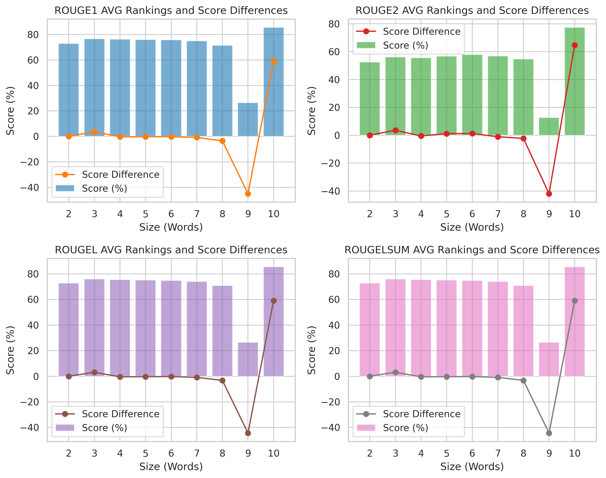

<!--- BADGES: START --->
<p align="center">
    <a href="https://smartcat.io/">
        <picture>
            <!-- Image for dark theme -->
            <source media="(prefers-color-scheme: dark)" srcset="https://github.com/smartcat-labs/product2query/blob/feat/readme/images/logo_smartcat_white.svg">
            <!-- Image for light theme -->
            <source media="(prefers-color-scheme: light)" srcset="https://github.com/smartcat-labs/product2query/blob/feat/readme/images/logo_smartcat_black.svg">
            <!-- Fallback image -->
            
        </picture>
    </a>
</p>
<p align="center">
    <a href="https://www.python.org/">
        
    </a>
    <!--CHECK THIS OUT AFTER CHANGING REPO TO PUBLIC -->
    <a href="https://github.com/smartcat-labs/product2query/blob/dev/LICENSE">
        
    </a>
    <!--CHANGE THE LINK TO THE NEW MODELS -->
    <a href="https://huggingface.co/collections/smartcat/product2query-6783f6786b250284f060918d">
        
    </a>
    <a href="https://huggingface.co/datasets/smartcat/Amazon-2023-GenQ">
        
    </a>
    <!-- <a href="https://colab.research.google.com/drive/1HfutiEhHMJLXiWGT8pcipxT5L2TpYEdt?usp=sharing">
        
    </a> -->
    <a href="https://github.com/smartcat-labs">
        
    </a>
</p>

<!--- BADGES: END --->  
# GenQ

🤖 ✨ 🔍 Generate precise, realistic user-focused search queries from text 🛒 🚀 📊

## Introduction
This project contains the code used to create the fine-tuned model GenQ. 
This model has been specifically designed to generate high-quality customer-like queries for e-commerce products, achieving improved performance compared to the base model.

This repository serves as a comprehensive resource for:

- **Data Preprocessing**: Scripts and utilities for preparing the dataset used in fine-tuning, ensuring a robust and effective training process.  

- **Model Fine-Tuning**: Code and configurations for fine-tuning the base model on the customized dataset.  

- **Performance Insights**: Configurations and examples showcasing the model's performance improvements and applications.  

By leveraging the GenQ model, e-commerce platforms and others can enhance search quality and generate more relevant queries tailored to their products.  
Whether you're looking to understand the data preparation process, fine-tune your own model, or integrate this solution into your workflow, this repository has you covered.  

## Table of Contents
- [Introduction](#introduction)
- [Model Details](#model-details)
- [Training](#training)
  - [Training Parameters](#training-parameters)
  - [Metrics Used](#metrics-used)
- [Setup](#setup)  
  - [Installation](#installation)
- [Usage and Examples](#usage)
  - [Intended Use](#intended-use)
  - [Examples of Use](#examples-of-use)
  - [Examples](#examples)
  - [How to Use](#how-to-use)
- [Model Analysis](#model-analysis)
- [Experiments](#experiments)

## Model Details

<strong>Model Name:</strong> Fine-Tuned Query-Generation Model <br>
<strong>Model Type:</strong> Text-to-Text Transformer <br>
<strong>Architecture:</strong> Based on a pre-trained transformer model: [BeIR/query-gen-msmarco-t5-base-v1](https://huggingface.co/BeIR/query-gen-msmarco-t5-base-v1) <br>
<strong>Primary Use Case:</strong> Generating accurate and relevant human-like search queries from product descriptions or articles<br>
<strong>Dataset:</strong> [smartcat/Amazon-2023-GenQ](https://huggingface.co/datasets/smartcat/Amazon-2023-GenQ)<br>
   
<br>

There are four models in our [collection](https://huggingface.co/collections/smartcat/product2query-6783f6786b250284f060918d) that are trained differently, with **T5-GenQ-TDC-v1** being our best performing model.

- **T5-GenQ-T-v1**: Trained on only the product titles  
- **T5-GenQ-TD-v1**: Trained on titles + descriptions of the products  
- **T5-GenQ-TDE-v1**: Trained on titles + descriptions of the products and a set of products with titles only (2x of the dataset)  
- **T5-GenQ-TDC-v1**: Trained on titles + descriptions of the products and a subset of products with titles only that had a similarity score with short queries above 85%


## Training

### Training parameters:
<ul>
    <li><strong>max_input_length:</strong> 512</li>
    <li><strong>max_target_length:</strong> 30</li>
    <li><strong>batch_size:</strong> 48</li>
    <li><strong>num_train_epochs:</strong> 8</li>
    <li><strong>evaluation_strategy:</strong> epoch</li>
    <li><strong>save_strategy:</strong> epoch</li>
    <li><strong>learning_rate:</strong> 5.6e-05</li>
    <li><strong>weight_decay:</strong> 0.01 </li>
    <li><strong>predict_with_generate:</strong> true</li>
    <li><strong>load_best_model_at_end:</strong> true</li>
    <li><strong>metric_for_best_model:</strong> eval_rougeL</li>
    <li><strong>greater_is_better:</strong> true</li>
    <li><strong>logging_startegy:</strong> epoch</li>
</ul>

### Metrics Used:
**[ROUGE](https://en.wikipedia.org/wiki/ROUGE_(metric))**, or **R**ecall-**O**riented **U**nderstudy for **G**isting **E**valuation, is a set of metrics used for evaluating automatic summarization and machine translation in NLP. The metrics compare an automatically produced summary or translation against a reference or a set of references (human-produced) summary or translation. ROUGE metrics range between 0 and 1, with higher scores indicating higher similarity between the automatically produced summary and the reference.  

In our evaluation, ROUGE scores are scaled to resemble percentages for better interpretability. The metric used in the training was ROUGE-L.

The results of our model variations are:

<table border="1" class="dataframe">
  <tr style="text-align: center;">
    <th>Model</th>
    <th>Epoch</th>
    <th>Step</th>
    <th>ROUGE-1</th>
    <th>ROUGE-2</th>
    <th>ROUGE-L</th>
    <th>ROUGE-Lsum</th>
  </tr>
  <tr>
    <td><b>T5-GenQ-T-v1</b></td>
    <td>7.0</td>
    <td>29995</td>
    <td>75.2151</td>
    <td>54.8735</td>
    <td><b>74.5142</b></td>
    <td>74.5262</td>
  </tr>
  <tr>
    <td><b>T5-GenQ-TD-v1</b></td>
    <td>8.0</td>
    <td>34280</td>
    <td>78.2570</td>
    <td>58.9586</td>
    <td><b>77.5308</b></td>
    <td>77.5466</td>
  </tr>
  <tr>
    <td><b>T5-GenQ-TDE-v1</b></td>
    <td>8.0</td>
    <td>68552</td>
    <td>76.9075</td>
    <td>57.0980</td>
    <td><b>76.1464</b></td>
    <td>76.1502</td>
  </tr>
  <tr>
    <td><b>T5-GenQ-TDC-v1</b></td>
    <td>8.0</td>
    <td>41448</td>
    <td><u><strong>80.0754</strong></u></td>
    <td><u><strong>61.5974</strong></u></td>
    <td><b><u><strong>79.3557</strong></u></b></td>
    <td><u><strong>79.3427</strong></u></td>
  </tr>
</table>

### Hardware

A6000 GPU:
<ul>
  <li>Memory Size: 48 GB</li>
  <li>Memory Type: GDDR6</li>
  <li>CUDA: 12.4</li>
</ul>

## Setup

### Installation
To get started, clone the repository and install the required dependencies:
```bash
git clone https://github.com/smartcat-labs/product2query.git
```
For installing and setting up poetry:
[Poetry Documentation](https://python-poetry.org/docs/)

After installing and setting up poetry, run   
```python
poetry install --no-root
```  
to install all necessary dependencies
<!--Set up the links to files-->
### Run training
For running the training, prepare the **config.yaml** file. If you don't want to modify it you can simply run the training with:
```bash
python -m modules.train.train \  
  -c config/config.yaml \  
  -o 'finetuned-model' \  
  --log_level INFO
```
If you want to test out the training on a sample of the dataset, set the ```dev``` flag to ```True``` in the **config.yaml** or simply run the training with:
```bash
python -m modules.train.train \  
  -c config/test_config.yaml \  
  -o 'finetuned-model' \  
  --log_level INFO
```
The best three models will be saved to train\runs\date_time\ by default.  
The checkpoint with the highest ROUGE-L score, which you can check in **evaluation_metrics.csv**, should be your best performing model.  
To check out each checkpoint, you can run the evaluation.

### Evaluation
The evaluation consists of generating queries with two models and calculating the results of each ROUGE metric. In our case, we ran the evaluation with the pre-trained model and our fine-tuned model.  

For running the evaluation, prepare the **eval_config.yaml** file. You must set the ```model_paths``` in the file to your checkpoint path to test out your model. If you don't want to modify the file you can simply run the evaluation with:
```bash
python -m modules.eval.model_eval -c config/eval_config.yaml
```
This will run the evaluation with our fine-tuned model by default.   

After it's finished, you can look at the results in the **generated_results.csv** saved to eval\runs\date_time\ by default.  

For further analysis use the **results_analysis.py** script with your **generated_results.csv** to create plots and see specific cases where your model had better/worse results.
To run the script, specify in the **analysis_config.yaml** file the path to your generated results, set the parameters to your liking and run the script with:
```bash
python -m modules.eval.results_analysis config/analysis_config.yaml
```

## Usage

### Intended use
This model is designed to enhance search functionality by generating user-friendly search queries based on textual descriptions. It is particularly suited for applications where descriptive text is the primary input, and the goal is to create concise, relevant queries that align with user search intent.  
### Examples of Use:
<li>Generating search queries for product or article indexing.</li>
<li>Enhancing product discoverability in e-commerce search engines.</li>
<li>Automating query generation for catalog management.</li>
   
### Examples

<table border="1" text-align: center>
  <thead>
    <tr>
      <th>Target Query</th>
      <th>Before Fine-tuning</th>
      <th>After Fine-tuning</th>
    </tr>
  </thead>
  <tbody>
    <tr>
      <td>flannel pajama set women's</td>
      <td>what to wear with a pajama set</td>
      <td>women's plaid pajama set</td>
    </tr>
    <tr>
      <td>custom name necklace</td>
      <td>what is casey name necklace</td>
      <td>personalized name necklace</td>
    </tr>
    <tr>
      <td>Large Satin Sleep Cap</td>
      <td>what is the size of a silk bonnet</td>
      <td>satin sleep cap</td>
    </tr>
  </tbody>
</table>


### How to use
```python
from transformers import AutoModelForSeq2SeqLM, AutoTokenizer

model = AutoModelForSeq2SeqLM.from_pretrained("smartcat/T5-GenQ-TDC-v1")
tokenizer = AutoTokenizer.from_pretrained("smartcat/T5-GenQ-TDC-v1")

description = "Silver-colored cuff with embossed braid pattern. Made of brass, flexible to fit wrist."

inputs = tokenizer(description, return_tensors="pt", padding=True, truncation=True)
generated_ids = model.generate(inputs["input_ids"], max_length=30, num_beams=4, early_stopping=True)

generated_text = tokenizer.decode(generated_ids[0], skip_special_tokens=True) 

```
## Model Analysis
<!-- T5-GenQ-TDC-v1   -->
<details open><summary><h4>T5-GenQ-TDC-v1</h4></summary>  
  <details open><summary>Average scores by model</summary>  
    <table style="width:100%"><tr>
    <td style="width:65%"></td>
    <td>

```checkpoint-41448``` (T5-GenQ-TDC-v1) outperforms ```query-gen-msmarco-t5-base-v1``` across all ROUGE metrics.  

The largest performance difference is in ROUGE2, where ```checkpoint-41448``` achieves 56.11, while ```query-gen-msmarco-t5-base-v1``` only reaches 15.29.  

ROUGE1, ROUGEL, and ROUGELSUM scores are similar in trend, with ```checkpoint-41448``` scoring above 75, while ```query-gen-msmarco-t5-base-v1``` remains below 35.</td></tr>
    </table>
  </details>

  <details><summary>Density comparison </summary>  
    <table style="width:100%"><tr>
    <td style="width:65%"></td>
    <td>

```checkpoint-41448``` (T5-GenQ-TDC-v1) consistently has a higher density peak at 100%. This suggests that a significant portion of its generated queries closely match the reference queries.   

For ROUGE1, ROUGEL, and ROUGELSUM, the ```query-gen-msmarco-t5-base-v1``` model has multiple peaks below 50%, indicating poorer alignment with reference queries.
In ROUGE2, a large portion of scores are near zero, meaning this model struggles with capturing bi-gram level similarity.   

While ```checkpoint-41448``` has a dominant peak around 100%, it also has scores across the spectrum, indicating a more varied performance across queries.   

```query-gen-msmarco-t5-base-v1``` struggles with higher ROUGE scores. The distribution remains largely below 50% across all metrics, with notable peaks close to 0%.
    </td></tr>
    </table>
  </details>

  <details><summary>Histogram comparison </summary>  
    <table style="width:100%"><tr>
    <td style="width:65%"></td>
    <td>
    
```checkpoint-41448``` (T5-GenQ-TDC-v1, blue) trends toward higher ROUGE scores, peaking near 100%.  

```query-gen-msmarco-t5-base-v1``` (orange) has more low-score peaks, especially in ROUGE-2, reinforcing its lower precision.  

These histograms confirm ```checkpoint-41448``` consistently generates more accurate text.</td></tr>
    </table>
  </details>

  <details><summary>Scores by generated query length </summary>  
    <table style="width:100%"><tr>
    <td style="width:65%"></td>
    <td>
This visualization tracks average ROUGE scores and score differences across word sizes:  

Stable ROUGE scores (Sizes 1-8): All metrics remain consistently high.  

Sudden score drop at 9 words, probably due to a small number of generated queries of that length.

Score differences remain near zero for most sizes, meaning consistent model performance across phrase lengths.
    </td></tr>
    </table>
  </details>

  <details><summary>Semantic similarity distribution </summary>  
    <table style="width:100%"><tr>
    <td style="width:65%"></td>
    <td>
    
This histogram shows cosine similarity between text pairs (generated query and target query):  

A strong peak near 1.0 suggests most pairs are highly semantically similar.  

Low similarity scores (0.0–0.4) are rare, indicating the dataset consists mostly of closely related text pairs.  

This distribution supports applications in duplicate detection, paraphrase identification, and retrieval-based NLP.</td></tr>
    </table>
  </details>

  <details><summary>Semantic similarity score against ROUGE scores </summary>  
    <table style="width:100%"><tr>
    <td style="width:65%"></td>
    <td>
This scatter plot matrix compares semantic similarity (cosine similarity) and ROUGE scores:  

Higher similarity → Higher ROUGE scores, indicating a positive correlation.  

ROUGE-1 & ROUGE-L show the strongest alignment, while ROUGE-2 has greater variance.  

Some low-similarity outliers still achieve moderate ROUGE scores, suggesting surface-level overlap without deep semantic alignment.  

These plots help assess how semantic similarity aligns with n-gram overlap metrics in text evaluation.</td></tr>
    </table>
  </details>
</details>

<!-- T5-GenQ-T-v1   -->

<details><summary><h4>T5-GenQ-T-v1</h4></summary>  
  <details><summary>Average scores by model</summary>  
    <table style="width:100%"><tr>
    <td style="width:65%"></td>
    <td>The checkpoint-29995 (T5-GenQ-T-v1) model outperforms query-gen-msmarco-t5-base-v1 across all ROUGE metrics.  

The largest performance gap is in ROUGE2, where checkpoint-29995 achieves 52.27, whereas query-gen-msmarco-t5-base-v1 scores 19.52.  

ROUGE1, ROUGEL, and ROUGELSUM scores are very similar in both trends, with checkpoint-29995 consistently scoring above 72, while query-gen-msmarco-t5-base-v1 stays below 41.</td></tr>
    </table>
  </details>

  <details><summary>Density comparison </summary>  
    <table style="width:100%"><tr>
    <td style="width:65%"></td>
    <td>

```T5-GenQ-T-v1``` - Higher concentration of high ROUGE scores, especially near 100%, indicating strong text overlap with references.  
      
```query-gen-msmarco-t5-base-v1``` – more spread-out distribution, with multiple peaks at 10-40%, suggesting greater variability but lower precision.  

ROUGE-1 & ROUGE-L: ```T5-GenQ-T-v1``` peaks at 100%, while ```query-gen-msmarco-t5-base-v1``` has lower, broader peaks.  

ROUGE-2: ```query-gen-msmarco-t5-base-v1``` has a high density at 0%, indicating many low-overlap outputs.
</td></tr>
    </table>
  </details>

  <details><summary>Histogram comparison </summary>  
    <table style="width:100%"><tr>
    <td style="width:65%"></td>
    <td>

```T5-GenQ-T-v1``` – higher concentration of high ROUGE scores, especially near 100%, indicating strong text overlap with references.  

```query-gen-msmarco-t5-base-v1``` – more spread-out distribution, with peaks in the 10-40% range, suggesting greater variability but lower precision.  

ROUGE-1 & ROUGE-L: ```T5-GenQ-T-v1``` shows a rising trend towards higher scores, while ```query-gen-msmarco-t5-base-v1``` has multiple peaks at lower scores.  

ROUGE-2: ```query-gen-msmarco-t5-base-v1``` has a high concentration of low-score outputs, whereas ```T5-GenQ-T-v1``` achieves more high-scoring outputs.</td></tr>
    </table>
  </details>

  <details><summary>Scores by generated query length </summary>  
    <table style="width:100%"><tr>
    <td style="width:65%"></td>
    <td>
This visualization analyzes average ROUGE scores and score differences across different query sizes.   

High ROUGE Scores for Most Sizes (3-9 words).    

ROUGE-1, ROUGE-2, ROUGE-L, and ROUGE-LSUM scores remain consistently high across most word sizes.  

Sharp Spike at Size 2:  

A large positive score difference at 2 words, suggesting strong alignment for very short phrases.  

Stable Score Differences (Sizes 3-9):  

After the initial spike at size 2, score differences stay close to zero, indicating consistent performance across phrase lengths.</td></tr>
    </table>
  </details>

  <details><summary>Semantic similarity distribution </summary>  
    <table style="width:100%"><tr>
    <td style="width:65%"></td>
    <td>This histogram visualizes the distribution of cosine similarity scores, which measure the semantic similarity between paired texts (generated query and target query). The majority of similarity scores cluster near 1.0, indicating that most text pairs are highly similar. A gradual increase in frequency is observed as similarity scores rise, with a sharp peak at 1.0. Lower similarity scores (0.0–0.4) are rare, suggesting fewer instances of dissimilar text pairs. </td></tr>
    </table>
  </details>

  <details><summary>Semantic similarity score against ROUGE scores </summary>  
    <table style="width:100%"><tr>
    <td style="width:65%"></td>
    <td>
This scatter plot matrix compares semantic similarity (cosine similarity) with ROUGE scores, showing their correlation.   

Higher similarity → Higher ROUGE scores, indicating strong n-gram overlap in semantically similar texts. ROUGE-1 & ROUGE-L show the strongest correlation, while ROUGE-2 has more variability. Low-similarity outliers exist, where texts share words but differ semantically.
    </td></tr>
    </table>
  </details>
</details>

<!-- T5-GenQ-TD-v1   -->

<details><summary><h4>T5-GenQ-TD-v1</h4></summary>  
  <details><summary>Average scores by model </summary>  
    <table style="width:100%"><tr>
    <td style="width:65%"></td>
    <td>

```checkpoint-34280``` (T5-GenQ-TD-v1) significantly outperforms ```query-gen-msmarco-t5-base-v1``` across all ROUGE metrics.  

The difference is most notable in ROUGE-2, where ```checkpoint-34280``` achieves 56.24% vs. 15.29% for the baseline model.  

These results suggest ```checkpoint-34280``` produces more precise and high-overlap text generations.</td></tr>
    </table>
  </details>

  <details><summary>Density comparison </summary>  
    <table style="width:100%"><tr>
    <td style="width:65%"></td>
    <td>
    
```checkpoint-34280``` (T5-GenQ-TD-v1) has strong peaks near 100%, indicating high overlap with reference texts.  

```query-gen-msmarco-t5-base-v1``` shows a broader distribution, with peaks at low to mid-range scores (10-40%), suggesting greater variability but lower precision.  

ROUGE-2 has a high density at 0% for the baseline model, implying many instances with no bigram overlap.</td></tr>
    </table>
  </details>

  <details><summary>Histogram comparison </summary>  
    <table style="width:100%"><tr>
    <td style="width:65%"></td>
    <td>
    
```checkpoint-34280``` (T5-GenQ-TD-v1, blue) shows a steady increase toward high ROUGE scores, peaking at 100%.  

```query-gen-msmarco-t5-base-v1``` (orange) has multiple low-score peaks, particularly in ROUGE-2, reinforcing its lower text overlap performance.  

These histograms confirm that ```checkpoint-34280``` consistently generates more accurate outputs.</td></tr>
    </table>
  </details>

  <details><summary>Scores by generated query length </summary>  
    <table style="width:100%"><tr>
    <td style="width:65%"></td>
    <td>
This visualization compares average ROUGE scores and score differences across different word sizes.  

Consistent ROUGE Scores (Sizes 2-8):  

ROUGE-1, ROUGE-2, ROUGE-L, and ROUGE-LSUM scores remain high and stable across most word sizes.  

Sharp Drop at Size 9:  

A significant decrease in scores occurs for size 9 words, with negative score differences, suggesting longer phrases are less aligned with reference texts.  

Score Differences Stay Near Zero (Sizes 2-8):  

Models perform similarly for shorter text spans but diverge at larger word sizes.
    </td></tr>
    </table>
  </details>

  <details><summary>Semantic similarity distribution </summary>  
    <table style="width:100%"><tr>
    <td style="width:65%"></td>
    <td>This histogram visualizes the distribution of cosine similarity scores, which measure the semantic similarity between paired texts (generated query and target query).  

A strong peak near 1.0 indicates that most pairs are highly semantically similar.  

Low similarity scores (0.0–0.4) are rare, suggesting the dataset consists mostly of highly related text pairs.</td></tr>
    </table>
  </details>

  <details><summary>Semantic similarity score against ROUGE scores </summary>  
    <table style="width:100%"><tr>
    <td style="width:65%"></td>
    <td>
This scatter plot matrix shows the relationship between semantic similarity (cosine similarity) and ROUGE scores:  

Higher similarity → Higher ROUGE scores, indicating a positive correlation.  

ROUGE-1 & ROUGE-L show the strongest alignment, while ROUGE-2 has greater variance.  

Some low-similarity outliers still achieve moderate ROUGE scores, suggesting surface-level overlap without deep semantic alignment.  

This analysis helps understand how semantic similarity aligns with n-gram overlap metrics for evaluating text models.
    </td></tr>
    </table>
  </details>
</details>

<!-- T5-GenQ-TDE-v1   -->

<details><summary><h4>T5-GenQ-TDE-v1</h4></summary>  
  <details><summary>Average scores by model </summary>  
    <table style="width:100%"><tr>
    <td style="width:65%"></td>
    <td>
    
```checkpoint-68552``` (T5-GenQ-TDE-v1) outperforms ```query-gen-msmarco-t5-base-v1``` across all ROUGE metrics.  

The most significant difference is in ROUGE-2, where ```checkpoint-68552``` scores 54.32% vs. 17.40% for the baseline model.</td></tr>
    </table>
  </details>

  <details><summary>Density comparison </summary>  
    <table style="width:100%"><tr>
    <td style="width:65%"></td>
    <td>

```checkpoint-68552``` (T5-GenQ-TDE-v1) peaks near 100%, showing strong text overlap.  

```query-gen-msmarco-t5-base-v1``` has a wider distribution, with peaks in the low to mid-score range (10-40%), indicating greater variability but lower precision.  

ROUGE-2 has a high density at 0% for the baseline model, meaning many outputs lack bigram overlap.</td></tr>
    </table>
  </details>

  <details><summary>Histogram comparison </summary>  
    <table style="width:100%"><tr>
    <td style="width:65%"></td>
    <td>
    
```checkpoint-68552``` (T5-GenQ-TDE-v1, blue) trends toward higher ROUGE scores, with a peak at 100%.  

```query-gen-msmarco-t5-base-v1``` (orange) has more low-score peaks, especially in ROUGE-2, reinforcing its lower precision.   

These histograms confirm ```checkpoint-68552``` consistently generates more accurate text.</td></tr>
    </table>
  </details>

  <details><summary>Scores by generated query length </summary>  
    <table style="width:100%"><tr>
    <td style="width:65%"></td>
    <td>
Stable ROUGE scores (Sizes 3-9): All metrics remain consistently high.  

Score spike at 2 words: Indicates better alignment for short phrases, followed by stability.  

Score differences remain near zero for most sizes, meaning consistent model performance across phrase lengths.</td></tr>
    </table>
  </details>

  <details><summary>Semantic similarity distribution </summary>  
    <table style="width:100%"><tr>
    <td style="width:65%"></td>
    <td>
This histogram visualizes the distribution of cosine similarity scores, which measure the semantic similarity between paired texts (generated query and target query).  

A strong peak near 1.0 suggests most pairs are highly semantically similar.  

Low similarity scores (0.0–0.4) are rare, meaning the dataset contains mostly closely related text pairs.</td></tr>
    </table>
  </details>

  <details><summary>Semantic similarity score against ROUGE scores </summary>  
    <table style="width:100%"><tr>
    <td style="width:65%"></td>
    <td>Higher similarity → Higher ROUGE scores, indicating strong correlation.  

ROUGE-1 & ROUGE-L show the strongest alignment, while ROUGE-2 has more variation.  

Some low-similarity outliers still achieve moderate ROUGE scores, suggesting surface-level overlap without deep semantic alignment.
</td></tr>
    </table>
  </details>
</details>

## Experiments

### Performance on Another Dataset

  <p>To assess the performance of our fine-tuned query generation model, we conducted evaluations on a dataset containing real user queries, which was not part of the fine-tuning data. The goal was to verify the model's generalizability and effectiveness in generating high-quality queries for e-commerce products.</p>

  For this experiment, we utilized [Studeni/amazon-esci-data](https://huggingface.co/datasets/Studeni/amazon-esci-data). From this dataset, we specifically selected queries that were in English and closely aligned with the corresponding product descriptions.
  
  <details><summary><b>Average scores by model</b></summary>  
    <table style="width:100%">
      <tr>
        <td style="width:65%">
          
        </td>
        <td>
          The figure presents a comparison of ROUGE scores between GenQ-TDC-v1 (checkpoint-41448) and the base model (query-gen-msmarco-t5-base-v1).  
          ROUGE scores (ROUGE-1, ROUGE-2, ROUGE-L, and ROUGE-LSUM) measure the similarity between generated queries and ground-truth user queries.  
          <br><br>
          The fine-tuned model outperforms the base model across all ROUGE metrics, with significant improvements in ROUGE-1, ROUGE-2, and ROUGE-LSUM.  
          <br><br>
          These improvements indicate that the fine-tuned model generates queries that are <b>more aligned with real user queries</b>, making it a better fit for practical e-commerce applications.
        </td>
      </tr>
    </table>
  </details>

  <details><summary><b>Semantic similarity distribution</b></summary>  
    <table style="width:100%">
      <tr>
        <td style="width:65%">
          
        </td>
        <td>
          The figure shows the distribution of semantic similarity scores (cosine similarity between the generated queries and real user queries.  
          <br><br>
          The distribution shows a peak around 0.1 - 0.2, with a secondary peak near 0.6 - 0.7.  
          <br><br>
          The bimodal nature of the distribution suggests that while a portion of generated queries are highly aligned with real user queries, some still exhibit lower similarity, likely due to domain-specific variations.  
          <br><br>
          A significant number of generated queries achieve a similarity score of 0.6 or higher, confirming that the fine-tuned model effectively captures user intent better than a generic, pre-trained model.
        </td>
      </tr>
    </table>
  </details>

  <p><b>Better Generalization:</b> Even though the fine-tuned model was not trained on this dataset, it generalizes better than the original model on real user queries.</p>

  <p><b>Improved Query Quality:</b> The fine-tuned model produces more relevant, structured, and user-aligned queries which is critical for enhancing search and recommendation performance in e-commerce.</p>

  <p><b>Robust Semantic Alignment:</b> Higher semantic similarity scores indicate that queries generated by the fine-tuned model <b>better match user intent, leading to improved search and retrieval performance.</b></p>
